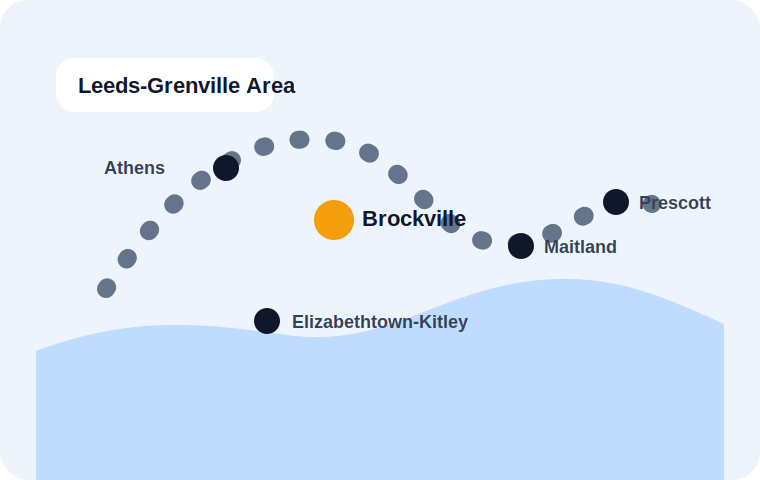
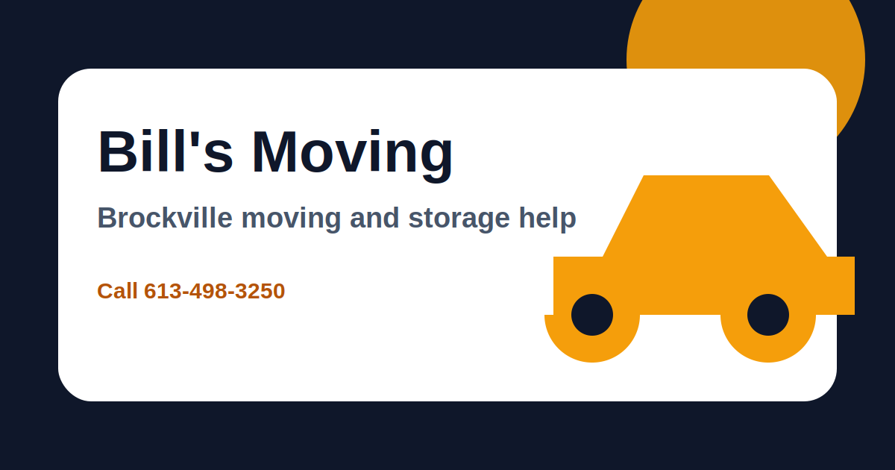

<!DOCTYPE html>
<html lang="en-CA">
<head>
  <meta charset="UTF-8" />
  <meta name="viewport" content="width=device-width, initial-scale=1.0" />
  <title>Bill's Moving | Brockville Moving & Storage Help</title>
  <meta name="description" content="Bill's Moving is a Brockville moving and storage service helping local residents with careful moves, furniture handling, packing support, senior transitions and short-term storage coordination." />
  <meta name="theme-color" content="#0f172a" />
  <meta property="og:title" content="Bill's Moving | Brockville Moving & Storage Help" />
  <meta property="og:description" content="A clean, local, mobile-ready website concept for Bill's Moving in Brockville, Ontario." />
  <meta property="og:type" content="website" />
  <meta property="og:image" content="assets/og-card.svg" />
  <link rel="icon" href="assets/favicon.svg" type="image/svg+xml" />
  <link rel="preload" href="styles.css" as="style" />
  <link rel="stylesheet" href="styles.css" />
  
</head>
<body>
  <!--
    Demo website package prepared for Bill's Moving, Brockville, Ontario.
    Public listing details should be confirmed by the business owner before live deployment.
  -->
  <a class="skip-link" href="#main">Skip to main content</a>

  <header class="site-header" id="top">
    <nav class="nav" aria-label="Primary navigation">
      <a class="brand" href="#top" aria-label="Bill's Moving home">
        
        <strong>Bill's Moving</strong><small>Brockville, Ontario</small>
      </a>
      <button class="nav-toggle" type="button" aria-expanded="false" aria-controls="nav-menu">Menu</button>
      

        <a href="#services">Services</a>
        <a href="#process">Process</a>
        <a href="#area">Service Area</a>
        <a href="#faq">FAQ</a>
        <a class="nav-call" href="tel:+16134983250">Call 613-498-3250</a>
      

    </nav>
  </header>

  <main id="main">
    <section class="hero section-pad">
      

        
Local moving and storage support

        <h1>Brockville moves handled with care, speed and common sense.</h1>
        
From apartments and small homes to furniture moves and storage transitions, Bill's Moving gives local customers a clear way to call, plan and get moving without the runaround.

        

          <a class="btn primary" href="tel:+16134983250">Call now</a>
          <a class="btn secondary" href="#quote">Request a quote</a>
        

        

          Local Brockville service
          Moving + storage
          Fast phone contact
        

      

      

        
        

          <strong>Need a move planned?</strong>
          Call for availability and details.
        

      

    </section>

    <section class="quick-info" aria-label="Quick business information">
      <a href="tel:+16134983250">Phone<strong>613-498-3250</strong></a>
      <a href="https://www.google.com/maps/search/?api=1&query=12+Keefer+St+Brockville+ON+K6V+1R7" target="_blank" rel="noopener">Location<strong>12 Keefer St, Brockville</strong></a>
      <a href="#quote">Quotes<strong>Fast request form</strong></a>
    </section>

    <section class="section-pad" id="services">
      

        
What we help with

        <h2>Practical moving services for Brockville homes, apartments and small businesses.</h2>
        
No inflated promises. Just clear help for the work people actually need: lifting, loading, transport coordination, packing support and storage-related moves.

      

      

        <article class="service-card reveal">
          
          <h3>Local moves</h3>
          
Apartment, condo and house moves across Brockville and nearby communities.

        </article>
        <article class="service-card reveal delay-1">
          
          <h3>Furniture moving</h3>
          
Help with heavy pieces, room-to-room moves, loading, unloading and careful handling.

        </article>
        <article class="service-card reveal delay-2">
          
          <h3>Packing support</h3>
          
Boxes, packing coordination and move-day preparation so the truck is not waiting on chaos.

        </article>
        <article class="service-card reveal">
          
          <h3>Storage transitions</h3>
          
Moving items into or out of storage, downsizing, staging and temporary relocation support.

        </article>
      

    </section>

    <section class="split section-pad dark-band" id="process">
      

        
      

      

        
Simple process

        <h2>A move should feel organized before anyone lifts a box.</h2>
        

          
01<strong>Call or request a quote</strong>
Share your address, move type, heavy items, stairs and timing.

          
02<strong>Confirm details</strong>
Get a clear plan for what is moving, where it is going and what help is needed.

          
03<strong>Move day</strong>
Efficient loading, careful handling and practical communication from start to finish.

        

      

    </section>

    <section class="section-pad" id="area">
      

        
Service area

        <h2>Built for Brockville and the surrounding Leeds-Grenville area.</h2>
        
This site is structured around the local searches customers actually use when they need a mover quickly.

      

      

        

          
        

        

          <h3>Common service locations</h3>
          <ul>
            <li>Brockville</li>
            <li>Prescott</li>
            <li>Maitland</li>
            <li>Athens</li>
            <li>Elizabethtown-Kitley</li>
            <li>Leeds and Grenville</li>
          </ul>
        

      

    </section>

    <section class="section-pad proof-band">
      

        
Why this site works

        <h2>Designed to turn directory traffic into phone calls.</h2>
      

      

        
<strong>Mobile-first</strong>
Big phone buttons and simple quote flow for people searching during a stressful move.

        
<strong>Local SEO</strong>
Search terms focus on “Brockville movers,” storage transitions and nearby communities.

        
<strong>Trust structure</strong>
Address, phone, process, service area and FAQs are visible without hunting.

      

    </section>

    <section class="section-pad" id="quote">
      

        

          
Get moving

          <h2>Request a move estimate.</h2>
          
Send the basics and Bill's Moving can follow up by phone. For fastest service, call directly.

        

        <form class="quote-form" action="mailto:example@example.com" method="post" enctype="text/plain">
          <label>Full name <input name="name" type="text" placeholder="Your name" required /></label>
          <label>Phone number <input name="phone" type="tel" placeholder="613-000-0000" required /></label>
          <label>Move details <textarea name="message" placeholder="Pickup, drop-off, stairs, large items, preferred date" required></textarea></label>
          <button class="btn primary" type="submit">Send request</button>
          
Owner note: connect this form to the business email before launch.

        </form>
      

    </section>

    <section class="section-pad faq" id="faq">
      

        
Questions

        <h2>Moving questions customers ask before they call.</h2>
      

      

        

Do you handle small moves?

Yes. This site is positioned for local moves, apartment moves, furniture moves and storage transitions. Final service details should be confirmed by phone.

        

Can I get help moving items into storage?

Yes. The public listings describe moving and storage, so the site includes storage transition support as a core service category.

        

What should I have ready before calling?

Pickup address, destination, preferred date, number of rooms, stairs/elevator access, large items and whether anything needs disassembly.

        

Do you serve outside Brockville?

The website is structured for Brockville and nearby communities. Exact availability should be confirmed directly.

      

    </section>
  </main>

  <footer class="footer">
    

      <a class="brand footer-brand" href="#top">
        
        <strong>Bill's Moving</strong><small>Brockville, Ontario</small>
      </a>
      
Moving and storage help from 12 Keefer St, Brockville, ON K6V 1R7.

    

    

      <a href="tel:+16134983250">613-498-3250</a>
      <a href="https://www.google.com/maps/search/?api=1&query=12+Keefer+St+Brockville+ON+K6V+1R7" target="_blank" rel="noopener">Open map</a>
      <a href="#quote">Request quote</a>
    

  </footer>

  

    <a href="tel:+16134983250">Call 613-498-3250</a>
    <a href="#quote">Quote</a>
  

  
</body>
</html>
